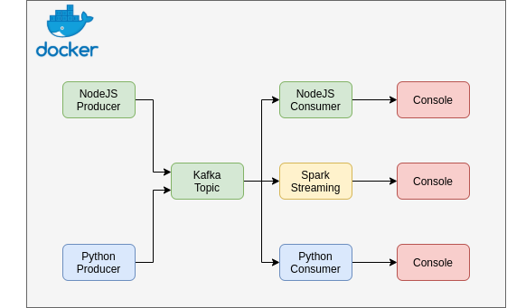

# Streaming data from Kafka Topic to Spark using Spark Structured Streaming V2.0

This version is optimized to be more lightweight. Everything runs from one simple command. There is no dependency on your computer to have apart from docker and docker-compose.

## Workflow

This project is a simple kafka and spark streaming architecture.
A docker-compose file initialize a kafka cluster and a spark cluster with all their dependencies.
Producers send text messages to kafka a topic named "test-topic".
You can either consume messages with consumers scripts written in NodeJS and Python or stream data with spark streaming which simply print on the console all received data.

> Warning: The data streaming only works with spark in scala for now, python version is in progress



Everything is automatic in this project.

All you have to do is run a simple script that will trigger everything.

You can then dive deeper into code and play around with it to get your hands dirty 😊

## Requirements

*   Docker & Docker Compose (https://docs.docker.com/engine/install/ubuntu/)
    *   docker >= 19.X.X 
    *   docker-compose ~1.29.2

> Please make sure:
*   you can run commands with root privileges on your computer
*   your port 8080 is not in use
*   the subnet 172.18.0.0/24 is not in use in your computer

## Project folder structure

```
.
├── architecture.png........ # Architecture of the project
├── clean-env.sh............ # Cleans the environment
├── docker-compose.yml...... # Create kafka and spark clusters
├── nodejs-consumer......... # Consumes messages from kafka
│   ├── consumer.js
│   ├── Dockerfile
│   ├── package.json
│   └── package-lock.json
├── nodejs-producer......... # Produces messages to kafka
│   ├── Dockerfile
│   ├── package.json
│   └── producer.js
├── python-consumer......... # Consumes messages to kafka
│   ├── consumer.py
│   └── Dockerfile
├── python-producer......... # Produces messages to kafka
│   ├── Dockerfile
│   └── producer.py
├── README.md
└── spark-streaming......... # Consume streaming data from kafka and sinks to console
    ├── python.............. # Streaming with python (Work In Progress)
    └── scala............... # Streaming with scala
```

## Running services

| service name             | address[:port]   |
|--------------------------|------------------|
| zookeeper                | 172.18.0.8:2181  |
| kafka (from host)        | 172.18.0.9:9093  |
| kafka (inside container) | 172.18.0.9:9092  |
| spark master             | 172.18.0.10:7077 |
| spark UI                 | 172.18.0.10:8080 |
| spark worker 1           | 172.18.0.11      |
| spark worker 2           | 172.18.0.12      |
| spark-streaming-kafka    | 172.18.0.13      |
| nodejs-producer          | 172.18.0.14      |
| nodejs-consumer          | 172.18.0.15      |
| python-producer          | 172.18.0.16      |
| python-consumer          | 172.18.0.17      |

The project creates a docker network name "kafka-spark" on the address range 172.18.0.0/24

## Getting Started

> Note: You can go through the docker-compose.yml or the run.sh files to better understand how things work. 

### 1. Clone the repo and cd into the folder

> Note: Be sure to be into the <kafka-spark-streaming-docker> directory

```
    git clone https://github.com/MDiakhate12/kafka-spark-streaming-docker.git
    cd kafka-spark-streaming-docker/
```

### 2. Run docker-compose.yml

> Important: Don't close the terminal after you have executed docker-compose <br>

```
docker-compose up 
```
> Note: Wait until all services are up (about 1 to 2 minutes, the console will be quite idle)

### 3. Submit the spark streaming job

> Note: Be sure to have root privileges

On a new terminal run the command

```bash
sudo chmod 777 jars_dir && \
docker exec -it spark \
spark-submit \
--packages "org.apache.spark:spark-sql-kafka-0-10_2.12:3.2.0" \
--master "spark://172.18.0.10:7077" \
--class Streaming \
--conf spark.jars.ivy=/opt/bitnami/spark/ivy \
ivy/spark-streaming-with-kafka_2.12-1.0.jar
```

After everything is set, your output should look like this:


That's it 🎉🎉   Congratulation.

## Look at the result

> Note: The spark UI is available at http://172.18.0.10:8080

On a new terminal, you can see logs of each service by running:

```
docker-compose logs -f [SERVICE_NAME]
```

Available services are:
1.  zookeeper
2.  kafka
3.  spark
4.  spark-worker-1
5.  spark-worker-2
6.  spark-streaming-kafka
7.  nodejs-producer
8.  nodejs-consumer
9.  python-producer
10. python-consumer
